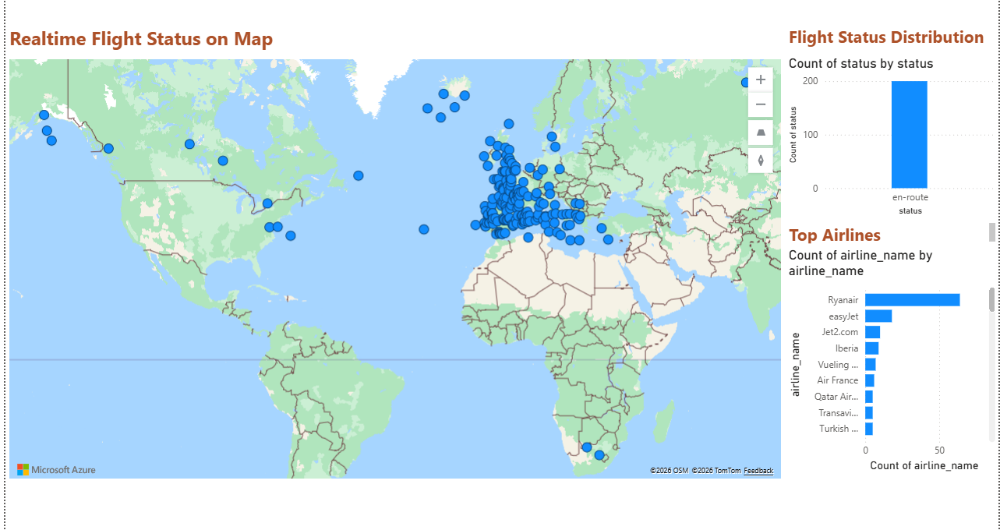
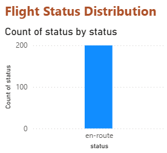
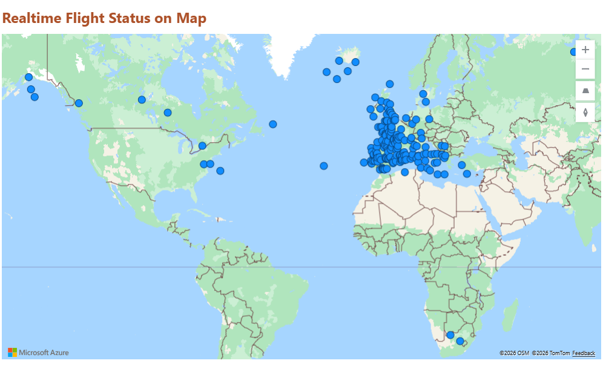
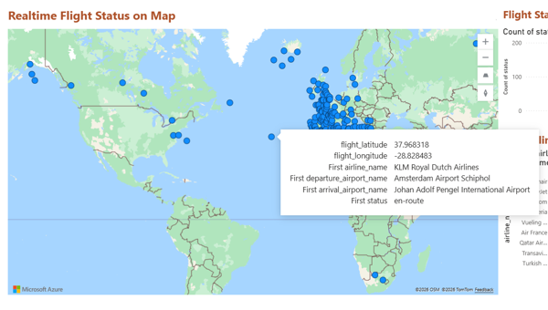
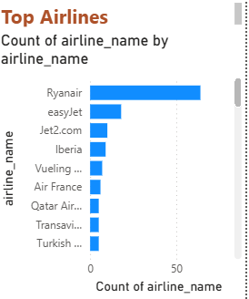

# ✈️ Real-Time Flight Status Analytics Platform

## 📌 Project Summary
This project demonstrates an end-to-end real-time analytics solution built using Microsoft Fabric. It ingests flight status data, processes it in near real time, and delivers interactive dashboards for monitoring and insights.

The solution showcases modern data engineering and BI practices, including streaming ingestion, scalable storage, and semantic modeling.

---
## 📸 Dashboard Preview

### 🌍 Flight Status Overview

### 📍 Map Visualization (Real-Time Flights)

### 📊 Top Airlines

## 🎯 Objectives
- Build a real-time or near real-time data pipeline
- Transform and store streaming flight data efficiently
- Deliver actionable insights through interactive dashboards
- Demonstrate practical use of Microsoft Fabric for analytics

---

## 🧱 Solution Architecture
The platform is built using components from Microsoft Fabric:

- **Data Ingestion** → Streaming / API-based ingestion  
- **Data Processing** → Dataflows Gen2 / Notebooks  
- **Storage** → Lakehouse (Delta tables)  
- **Semantic Layer** → Power BI semantic models  
- **Visualization** → Power BI dashboards  

---

## 🔄 Data Flow
1. Flight data is ingested from an external source (API / stream)  
2. Data is cleaned and transformed using Fabric pipelines  
3. Processed data is stored in the Lakehouse  
4. Semantic models are created for reporting  
5. Dashboards provide real-time insights to users  

---

## 📊 Key Features
1. Flight data ingested via API / streaming source  
2. Processed using Fabric pipelines and dataflows  
3. Stored in Lakehouse (Delta tables)  
4. Semantic model created for reporting  
5. Visualized through Power BI dashboards  

---

## 🛠️ Technologies Used
- Microsoft Fabric  
- Power BI  
- Lakehouse (Delta)  
- Dataflows Gen2  
- Pipelines / Notebooks  

---

## 📂 Repository Structure
- `/Reports` → Power BI reports  
- `/SemanticModels` → Data models  
- `/Dataflows` → Data transformation logic  
- `/Pipelines` → Data ingestion workflows  
- `/Notebooks` → Data processing scripts  
- `/screenshots` → Dashboard visuals  

---

## 🚀 Deployment & Setup
1. Connect this repository to a Microsoft Fabric workspace  
2. Sync artifacts using Git integration  
3. Configure data source connections (API / streaming source)  
4. Refresh datasets and validate reports  

---

## 📈 Business Value
This solution enables:
- Enables real-time monitoring of flight activity  
- Provides insights into flight status distribution  
- Highlights top-performing airlines  
- Demonstrates scalable real-time analytics architecture   

---

## ⚠️ Important Notes
- Real-time data connections cannot be publicly shared due to Power BI limitations  
- Data source credentials are not included in this repository  
- Screenshots are provided for demonstration purposes  

---

## 🌟 Highlights for Recruiters
- Built an end-to-end real-time data pipeline  
- Hands-on experience with Microsoft Fabric  
- Developed interactive dashboards in Power BI  
- Worked with near real-time data processing  

---

## 👤 Author
Sandya Duggana 
